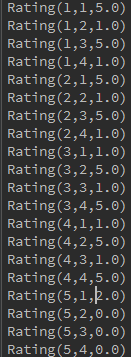
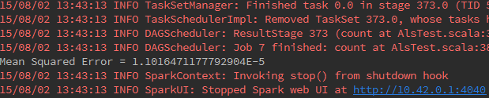
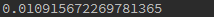
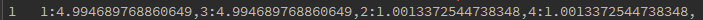
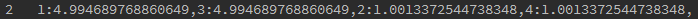
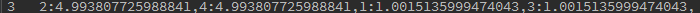
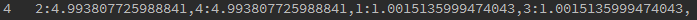
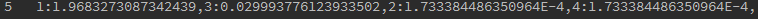

#
ALS协同过滤算法

###
Lyen

###1.简介:
 协同过滤常被应用于推荐系统，旨在补充用户-商品关联矩阵中所缺失的部分。MLlib当前支持基于模型的协同过滤，其中用户和商品通过一小组隐语义因子进行表达，并且这些因子也用于预测缺失的元素。Spark MLlib实现了交替最小二乘法 (ALS) 来学习这些隐性语义因子。在 MLlib 中的实现有如下的参数:

    1.numBlocks 是用于并行化计算的分块个数 (设置为-1，为自动配置)。
    2.rank 是模型中隐语义因子的个数。
       ps: 用户根据对物品的一些属性对物品的评价情况，比如用户买一个商品是因为它美观，实用        
       那么美观，实用这两个因素就是模型中的隐语因子，即2个隐语因子隐语义模型其实就是用户
       评价数据的因子分析，得到各个商品的主要因子，用的原理都是SVD(奇异值分解)
    3.iterations 是迭代的次数。
    4.lambda 是ALS的正则化参数。
    5. implicitPrefs 决定了是用显性反馈ALS的版本还是用适用隐性反馈数据集的版本。
    6.alpha 是一个针对于隐性反馈 ALS 版本的参数，这个参数决定了偏好行为强度的基准。

可以调整这些参数，不断优化结果，使均方差变小。比如：iterations越多，lambda较小，均方差会较小，推荐结果较优。
###2.spark mllib中ALS算法的思想
a.ALS[算法思想](http://www.zhihu.com/question/31509438/answer/52268608)详细介绍。

b.举例说明:
在接下来的例子中我们额定载荷数据。每一行包含一个用户、一个产品和一个评级。我们使用默认ALS.train()方法,假设评级是明确的。我们评估推荐模型评级预测均方误差的测量。代码如下：

        def main(args: Array[String]) {
                val conf = new SparkConf().setAppName("ALS").setMaster("local")
                val sc = new SparkContext(conf)
                // 加载和解析数据文件
                val data = sc.textFile("/home/lyen/conf/spark1.4/data/mllib/als/test.data")
                val ratings = data.map(_.split(",")match{
                case Array(user,item,rate) => Rating(user.toInt,item.toInt,rate.toDouble) })
                //设置迭代次数
                val numIterations = 20
                //即将训练的RDD，rank值为10,迭代次数（numIterations），ALS的正则化参数。(目的是为了减小误差)
                val model = ALS.train(ratings,10,numIterations,0.01)
                //对模型进行评分
                val userProducts = ratings.map({case Rating(user,product,rate) =>(user,product)})
                val predictions =model.predict(userProducts).map({caseRating(user,product,rate)=>((user,product),rate)})
                val ratesAndPreds = ratings.map({case Rating(user,product,rate)=>((user,product),rate)}).join(predictions)
                //MSE 均方差     ps:标准差²＝方差
                val MSE = ratesAndPreds.map { case ((user, product), (r1, r2)) =>       
                             val err = (r1 - r2)                                                   
                                   err * err                                                             
                             }.mean()                                                                
               println("Mean Squared Error = " + MSE) 
               /*  均方差的第二种方式                              
                val MSE = ratesAndPreds.map({case ((user,product),(r1,r2))=>math.pow((r1-r2),2)}
                ).reduce(_+_)/ ratesAndPreds.count()
               println("Mean Squared Error = " + MSE)
               */
                //用户推荐商品
              //为每个用户进行推荐，推荐的结果可以以用户id为key
                val users=data.map(_.split(",") match { case Array(user, product, rate) => (user)}).distinct().collect()
                users.foreach(user => {
                //依次为用户推荐商品
                var rs = model.recommendProducts(user.toInt, numIterations)
                var value = ""
                var key = 0
                //拼接推荐结果
                rs.foreach(r => {
                key = r.user
                value = value + r.product + ":" + r.rating + ","
                })
                println(key.toString+"   " + value)
                //model的加载和保存
                model.save(sc, "myModelPath")
                val sameModel = MatrixFactorizationModel.load(sc, "myModelPath")
          }  )
      }

c.运行效果图：

源数据：

MSE 均方差

 

RMSE 均方根差

1.

2.

3.

4.

5.

图1,2,3,4,5是1,2,3,4,5号用户对名个商品的预测评分，在数据量大的情况下可以根据其各个用户对每个商品的预测评分的高低中选出预测评分最高的几个商品作为对各个用户的推荐商品。比如在图5中5号用户只是对1号商品购买并进行了评分，而经过ALS算法根据相似计算预测出5号用户对2,3,4号商品的评分，这样我们可以根据5号用户所对应的2,3,4号商品的评分值中选取最高的预测的评分所对应的商品为5号用户推荐，即2号和4号商品。

d.分析与总结

通常用于推荐引擎评价的指标是称为最小均方根误差( RootMeanSquaredError, RMSE ) 指标 , 它首先计算均方误差的平均值然后取其平方根。如果评级在 1 星到 5 星这个范围内,而我们得到的 RMSE为 1.0, 那么就意味着我们的预测值和用户给出的真实评价相差了一个星级。  

ALS算法的核心就是将稀疏评分矩阵分解为用户特征向量矩阵和产品特征向量矩阵的乘积交替使用最小二乘法逐步计算用户/产品特征向量，使得差平方和最小通过用户/产品特征向量的矩阵来预测某个用户对某个产品的评分 。       
       
由于数学能力有限，在此并没有仔细说明LSA（最小二乘法）的计算方法，只是对这个算法怎么用做了简单介绍，对ALS协同过滤法的工作原理惊醒了剖析。ps:要想理解ALS，则应仔细阅读[ALS思想](http://www.zhihu.com/question/31509438/answer/52268608)举例介绍（上边已提到过）,其中也包括对最小二乘法的详细计算介绍。
###ALS算法应用

近十年来,推荐引擎对因特网用户而言已经不是什么新鲜事物了。 Amazon会根据顾客的购买历史向他们推荐物品, NEtflix会向其用户推荐电影,新闻网站会对用户推荐新闻报道,这样的例子还有很多很多。当然,有很多方法可以实现推荐功能,这里我们只使用一种称为协同过滤( collaborative filtering ) 的 方法。协同 过滤是通过将用户和其他用户的数据进行对比来实现推荐的。

这里的数据是从概念上组织成了类似图 14-2 所给出的矩阵形式。当数据采用这种方式进行组织 时 ,我们就可以比较用户或物品之间的相似度了。这两种做法都会使用我们很快就介绍到的相似度的概念。当知道了两个用户或两个物品之间的相似度,我们就可以利用已有的数据来预测未知的用户喜好。例 如 ,我们试图对某个用户喜欢的电影进行预测, 推荐引擎会发现有一部电影该用户还没看过。然 后 ,它就会计算该电影和用户看过的电影之间的相似度,如果其相似度很高,推荐算法就会认为用户喜欢这部电影。
 

                
