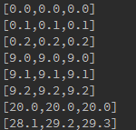
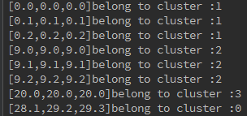
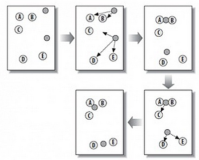

#
K-Means算法

##
Lyen

首先要来了解的一个概念就是聚类，简单地说就是把相似的东西分到一组，同 Classification (分类)不同， 对于一个 classifier ，通常需要你告诉它“这个东西被分为某某类”这样一些例子，理想情况下，一个 classifier 会从它得到的训练集中进行“学习”，从而具备对未知数据进行分类的能力，这种提供训练数据的过程通常叫做 supervised learning (监督学习)，而在聚类的时候，我们并不关心某一类是什么，我们需要实现的目标只是把相似的东西聚到一起，因此，一个聚类算法通常只需要知道如何[计算相似度](http://wenku.baidu.com/link?url=D6Anniohd8zD0KF7HfUZEDeUxtXj6RwWt5UDYmDdvLIibuOWDhOSW1DVVugOAT9HOnr3rKL3rZ-UMLPexQngSQ9Jyv83X_yR33HgC-HQM-i)就可以开始工作了。ps:（不同的相似度计算方法应用于不同的场景，在聚类中应充分考虑使用哪一种相似度计算方法）。因此 clustering 通常并不需要使用训练数据进行学习，这在 Machine Learning 中被称作 unsupervised learning (无监督学习)。

###1.算法基本简介
k-means 算法接受输入量 k ；然后将n个数据对象划分为 k个聚类以便使得所获得的聚类满足：同一聚类中的对象相似度较高；而不同聚类中的对象相似度较小。聚类相似度是利用各聚类中对象的均值所获得一个“中心对象”（引力中心）来进行计算的。
###2.处理流程
1、从D(数据源)中随机取k个元素，作为k个簇的各自的中心。

2、分别计算剩下的元素到k个簇中心的相异度，将这些元素分别划归到相异度最低的簇。

3、根据聚类结果，重新计算k个簇各自的中心，计算方法是取簇中所有元素各自维度的算术平均数。

4、将D中全部元素按照新的中心重新聚类。

5、重复第4步，直到聚类结果不再变化，即收敛。

ps:算法第一步中是随机的选取任意k个对象作为初始聚类的中心，初始地代表一个簇。该算法在每次迭代中对数据集中剩余的每个对象， 
根据其与各个簇中心的距离将每个对象重新赋给最近的簇。当考察完所有数据对象后，一次迭代运算完成，新的聚类中心被计算出来。 
如果在一次迭代前后，J的值没有发生变化，说明算法已经收敛。

6、将结果输出。
###3.举例说明
ps:数据位于spark包下的/data/mllib/kmeans_data.txt文件中

测试代码：

            def main(args: Array[String]) {
                val conf = new SparkConf().setAppName("KMeans").setMaster("local")
                val sc = new SparkContext(conf)
                //加载和解析数据
                val data = sc.textFile("/home/lyen/conf/spark1.4/data/mllib/kmeans_data.txt")
                val parsedData = data.map(s=>Vectors.dense(s.split(" ").map(_.toDouble))).cache()
                parsedData.foreach(println)
              
                //设置k值和迭代次数
                val numClusters = 4
                val numIterations = 20
                
                //评价聚类计算内设置的平方误差的总和（WSSSE）
                val clusters = KMeans.train(parsedData, numClusters, numIterations)
                val WSSSE = clusters.computeCost(parsedData)
                
                //输出中心点
                clusters.clusterCenters.foreach(center=>println("  " + center))
                
                //源数据分类结果
                parsedData.map(v => v.toString + "belong to cluster :" + clusters.predict(v)).collect().foreach(println)
                
                //使用训练好的模型测试
                println("Prediction of (1.1, 2.1, 3.1): "
                  + clusters.predict(Vectors.dense(Array(1.1, 2.1, 3.1))))
                println("Prediction of (10.1, 9.1, 11.1): "
                  + clusters.predict(Vectors.dense(Array(10.1, 9.1, 11.1))))
                println("Prediction of (21.1, 17.1, 16.1): "
                  + clusters.predict(Vectors.dense(Array(21.1, 17.1, 16.1))))
                println("Prediction of (5.2, 5.3, 5.5): "
                  + clusters.predict(Vectors.dense(Array(5.2, 5.3, 5.5))))
                sc.stop()
                println("Within Set Sum of Squared Errors = " + WSSSE)
                }
测试结果如下所示：

1.源数据：

2.中心点(k)

3.聚集后源数据所对应的簇

4.评价聚类计算内设置的平方误差的总和（WSSSE）

5.输入4组测试数据得到测试数据所属簇

###4.K-Means之图解

从上图中，我们可以看到，A，B，C，D，E是五个在图中点。而灰色的点是我们的种子点，也就是我们用来找点群的点。有两个种子点，所以K=2。

然后，K-Means的算法如下：

    1. 随机在图中取K（这里K=2）个种子点。
    2.然后对图中的所有点求到这K个种子点的距离，假如点Pi离种子点Si最近，那么Pi属于Si点群。（上图中，我们可以看到A，B属于上面的种子点，C，D，E属于下面中部的种子点）
    3.接下来，我们要移动种子点到属于他的“点群”的中心。（见图上的第三步）
    4.然后重复第2）和第3）步，直到，种子点没有移动（我们可以看到图中的第四步上面的种子点聚合了A，B，C，下面的种子点聚合了D，E）。

###K-Means算法应用
K-Means算法看来很简单，而且好像就是在玩坐标点，没什么真实用处。而且，这个算法缺陷很多，还不如人工呢。是的，前面的例子只是玩二维坐标点，的确没什么意思。但是你想一下下面的几个问题：

1）如果不是二维的，是多维的，如5维的，那么，就只能用计算机来计算了。

2）二维坐标点的X，Y 坐标，其实是一种向量，是一种数学抽象。现实世界中很多属性是可以抽象成向量的，比如，我们的年龄，我们的喜好，我们的商品，等等，能抽象成向量的目的就是可以让计算机知道某两个属性间的距离。如：我们认为，18岁的人离24岁的人的距离要比离12岁的距离要近，鞋子这个商品离衣服这个商品的距离要比电脑要近，等等。只要能把现实世界的物体的属性抽象成向量，就可以用K-Means算法来归类了。

在《k均值聚类(K-means)》 这篇文章中举了一个很不错的应用例子，作者用亚洲15支足球队的2005年到1010年的战绩做了一个向量表，然后用K-Means把球队归类，得出了下面的结果，呵呵。

    亚洲一流：日本，韩国，伊朗，沙特
    亚洲二流：乌兹别克斯坦，巴林，朝鲜
    亚洲三流：中国，伊拉克，卡塔尔，阿联酋，泰国，越南，阿曼，印尼
其实，这样的业务例子还有很多，比如，分析一个公司的客户分类，这样可以对不同的客户使用不同的商业策略，或是电子商务中分析商品相似度，归类商品，从而可以使用一些不同的销售策略，等等。

###总结
a.K-MEANS算法

输入：聚类个数k，以及包含 n个数据对象的数据库。 
输出：满足方差最小标准的k个聚类。

b.在使用K-Means算法时应在注意对应场景对需要用到的相似度计算方法，常用的计算相似方法有：

1.皮尔逊相关系数Pearson Correlation Coefficient） 
2.欧几里德距离（Euclidean Distance）,也叫做欧式距离 
3.Cosine 相似度（Cosine Similarity） 
4.曼哈顿距离（CityBlockSimilarity ），也叫做城市街区算法 

ps:详细计算过程以及公式请参照[相似度计算](http://wenku.baidu.com/link?url=D6Anniohd8zD0KF7HfUZEDeUxtXj6RwWt5UDYmDdvLIibuOWDhOSW1DVVugOAT9HOnr3rKL3rZ-UMLPexQngSQ9Jyv83X_yR33HgC-HQM-i)。

c.前方高能，请注意！

1.对于可以确定K值不会太大但不明确精确的K值的场景，可以进行迭代运算，然后找出WSSSE最小时所对应的K值，这个值往往能较好的描述有多少个簇类。

2.算法优点

K-Means聚类算法的优点主要集中在: 
1.算法快速、简单;
2.对大数据集有较高的效率并且是可伸缩性的;
3.时间复杂度近于线性，而且适合挖掘大规模数据集。K-Means聚类算法的时间复杂度是O(nkt) ,其中n代表数据集中对象的数量，t代表着算法迭代的次数，k代表着簇的数目。

3.算法缺点
k-means 算法缺点 
① 在 K-means 算法中 K 是事先给定的，这个 K 值的选定是非常难以估计的。很多时候，事先并不知道给定的数据集应该分成多少个类别才最合适。这也是 K-means 算法的一个不足。有的算法是通过类的自动合并和分裂，得到较为合理的类型数目 K，例如 ISODATA 算法。关于 K-means 算法中聚类数目K 值的确定在文献中，是根据方差分析理论，应用混合 F统计量来确定最佳分类数，并应用了模糊划分熵来验证最佳分类数的正确性。在文献中，使用了一种结合全协方差矩阵的 RPCL 算法，并逐步删除那些只包含少量训练数据的类。而文献中使用的是一种称为次胜者受罚的竞争学习规则，来自动决定类的适当数目。它的思想是：对每个输入而言，不仅竞争获胜单元的权值被修正以适应输入值，而且对次胜单元采用惩罚的方法使之远离输入值。

② 在 K-means 算法中，首先需要根据初始聚类中心来确定一个初始划分，然后对初始划分进行优化。这个初始聚类中心的选择对聚类结果有较大的影响，一旦初始值选择的不好，可能无法得到有效的聚类结果，这也成为 K-means算法的一个主要问题。对于该问题的解决，许多算法采用遗传算法（GA），例如文献 中采用遗传算法（GA）进行初始化，以内部聚类准则作为评价指标。

③ 从 K-means 算法框架可以看出，该算法需要不断地进行样本分类调整，不断地计算调整后的新的聚类中心，因此当数据量非常大时，算法的时间开销是非常大的。所以需要对算法的时间复杂度进行分析、改进，提高算法应用范围。在文献中从该算法的时间复杂度进行分析考虑，通过一定的相似性准则来去掉聚类中心的侯选集。而在文献中，使用的 K-means 算法是对样本数据进行聚类，无论是初始点的选择还是一次迭代完成时对数据的调整，都是建立在随机选取的样本数据的基础之上，这样可以提高算法的收敛速度。

