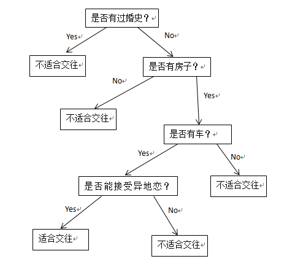
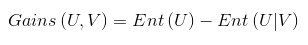
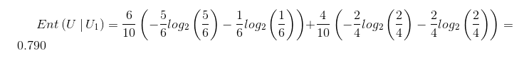
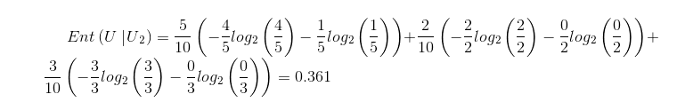
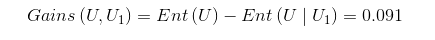
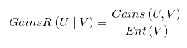
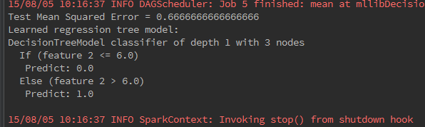

<center>决策树算法详解
-------------------------
&nbsp;&nbsp;&nbsp;&nbsp;决策树也是常用的分类算法之一,与其它分类算法相比具有分类精度高,生成模型简单,不用预先了解模型的特征等优点.决策树算法有ID3,C4.5,CART等几种,一个决策树包含三种类型的节点： 1.决策节点——通常用矩形框来表式 2.机会节点——通常用圆圈来表式 3.终结点——通常用三角形来表示,如下图:
<br><center></center>
<br>&nbsp;&nbsp;&nbsp;&nbsp;为了直观起见,大家可以去玩一款游戏-[网络天才(akinator)](http://cn.akinator.com/),这个游戏是通过询问一些问题来猜出你心中所想的人,准确率非常高,是不是很神奇呢?它的原理就类似决策树,建立一个树模型,通过一个个的问题来一步步的排除其余的人,最终猜出你心中所想的人.比如现在我们就来模拟一下.
我们通过一段对话来判断对方是否适合交往.

<center>是否有过婚史?&nbsp;no
是否有房子?&nbsp;yes
是否有车?&nbsp;yes
能不能接受异地恋?&nbsp;yes
那我们交往嘛.</center>

这个就利用了决策树的思想,通过对节点的不同的选择决策得到不同的结果.我们把这个转换为决策树模型看看.
<br>

&nbsp;&nbsp;&nbsp;&nbsp;决策树算法就是为了解决这个问题,在大家玩akinator游戏的时候应该会发现,在游戏开始的前几个问题一般都是你描述的对象真实存在吗?你描述的对象是女性吗?等等这些问题,这些在一开始就会筛选掉一大半的人物,如果把这些问题放在后面的话就会浪费很多时间,这说明了选择合理分支是很重要的,如何将这些众多的分支属性按照其价值大小排序就是我们要考虑的问题.而如何判定信息属性的价值就涉及到信息论的知识了,首先普及下数学概念.
信息是个抽象的概念,直到1948年，香农提出了“信息熵”的概念，才解决了对信息的量化度量问题.
信息熵的数学定义为:
<br>

条件熵的定义为:
<br>

信息增益的定义为
<br>

在这里我将主要介绍ID3及C4.5,先看ID3，
ID3算法的思想就是计算出每个属性的信息增益,把最大者作为分裂属性。
首先构造如下数据：
<br>

U1和U2都是条件维度，分别决定了是否购买，首先我们来算信息熵：
<br>
<br>条件熵：
<br>
<br>
信息增益:
<br>
<br>

由于Gains（U，U1）<Gains（U，U2）,表示U2消除信源的不确定性更大，则会采用U2作为最佳分组变量。但是采用ID3算法时遇到类别值多的输入变量比类别值少的输入变量有更多的机会成为当前最佳分组变量时就会不精确了。为了消除这种情况，我们就更多的采用C4.5算法。C4.5中的信息增益定义为：



具体计算结果就不计算了。
接下来我用MLlib里面的DecisionTree算法写个例子测试下，DecisionTree可作回归也可作分类，如果是回归则调用trainRegressor方法，如果是分类就调用trainClassifier方法， 其中的数据为官方源码自带的sample_libsvm_data.txt数据，这个数据用的标准的libsvm格式，对很多算法都适用。
源码如下：
<br>

```scala
	
import org.apache.spark.mllib.linalg.Vectors
import org.apache.spark.{SparkContext, SparkConf}

/**
 * Created by kexu on 15-8-4.
 */


import org.apache.spark.mllib.tree.DecisionTree
import org.apache.spark.mllib.tree.model.DecisionTreeModel
import org.apache.spark.mllib.util.MLUtils

object mllibDecisionTreesTest {		

def main(args: Array[String]) {
val conf = new SparkConf().setAppName("mllibDecisionTreesTest").setMaster("local[2]")
val sc = new SparkContext(conf)
// Load and parse the data file.
// val data = MLUtils.loadLibSVMFile(sc, "/home/kexu/下载/spark-1.4.1/data/mllib/sample_libsvm_data.txt")
val data =MLUtils.loadLibSVMFile(sc,"/home/kexu/桌面/libsvm1")
// Split the data into training and test sets (30% held out for testing)
val splits = data.randomSplit(Array(0.7, 0.3))
val (trainingData, testData) = (splits(0), splits(1))

// 训练一个决策树模型
//  空 categoricalFeaturesInfo 指示所有特征是连续的.
val categoricalFeaturesInfo = Map[Int, Int]()
val impurity = "variance"  //方差
val maxDepth = 5   //最大树深度
val maxBins = 32   //最大的划分数

//val model = DecisionTree.trainRegressor(trainingData, categoricalFeaturesInfo, impurity,
// maxDepth, maxBins)
val model = DecisionTree.trainClassifier(trainingData, 2, categoricalFeaturesInfo,
  "gini", maxDepth, maxBins)

 // 测试实例的评估模型和测试误差
 val labelsAndPredictions = testData.map { point =>
  val prediction = model.predict(point.features)
  (point.label, prediction)
}
 val testMSE = labelsAndPredictions.map { case (v, p) => math.pow((v - p), 2) }.mean()
 println("Test Mean Squared Error = " + testMSE)
 println("Learned regression tree model:\n" + model.toDebugString)

 // Save and load model
 // model.save(sc, "myModelPath3")
 // val sameModel = DecisionTreeModel.load(sc, "myModelPath3")

 }
}
 ```
<br>
这个例子是个回归算法，调用了trainRegressor，如果是写分类的话和这个类似，我们看一下输出

<br>
<br>


其中的Test Mean Squared Error是均方差误差，下面的是决策树模型结构，显示出树的节点和深度信息等，一个If....Else表示一个分支。
MLlib中的决策树算法还有其它变种，有兴趣的朋友可以继续学习。


